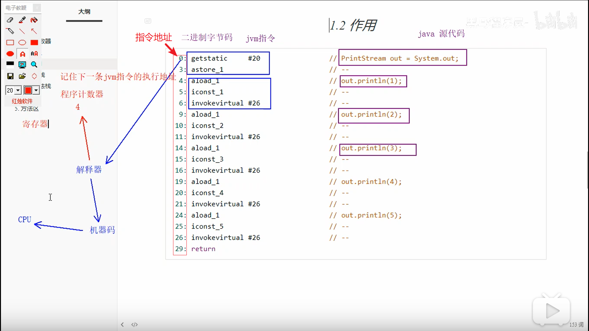
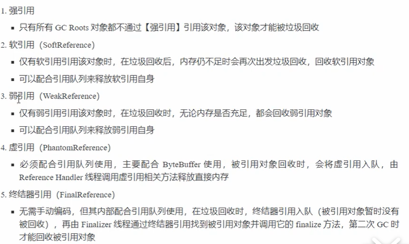
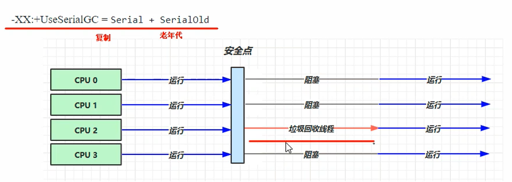

# JVM

## 一.概述

1. 定义:

   java程序的运行环境(java二进制 字节码的运行环境)

   好处:

   * 一次编写到处运行
   * 自动内存管理,垃圾回收功能
   * 数组下标越界检查
   * 多态

   比较:

   JDK,jre(java运行时环境),jvm

   

2. 常见的jvm

   jvm是一套规范,市面上有许多的jvm,我们学习的是Hotspot

   
   
3. 学习路线

   

   >  内存结构,垃圾回收机制,.class文件结构,类加载器


## 二.内存结构

| 线程共享  |            线程私有            |
| :-------: | :----------------------------: |
| 方法区,堆 | 虚拟机栈,程序计数器,本地方法栈 |


### 1.程序计数器-pc register

* 作用:存放下一条欲执行指令的地址



* 特点
  * **线程私有**的:每个线程都有一个程序计数器
  * 程序计数器不会出现内存溢出问题

### 2.虚拟机栈

* 每个线程运行时所需要的内存,称为*虚拟机栈*
* 每个栈由多个*栈帧*组成,对应着每次方法调用时所占用的内存
* 每个线程只能有一个活动栈帧,对应着当前正在执行的那个方法


* 栈帧由**局部变量表**和**操作数栈**组成

  

> 问题辨析:
>
> 1.垃圾回收是否涉及栈内存
>
> 不涉及栈内存,栈帧在弹出栈后,内存会自动回收,不需要垃圾回收器来管理
>
> 2.栈内存是否越大越好?
>
> 否.栈内存过大反而会使得线程数量减少
>
> 3.方法内的局部变量是否线程安全?
>
> 如果局部变量是私有的就是安全的,如果不是私有的那就不安全,例如static修饰的变量,多个线程只会共享这一个变量.
>
> 看一个局部变量是否是线程安全的,就看这个局部变量的作用域是否是引用型变量,并且是否局限在这个方法内部,如果是,则不会出现线程安全带额问题.如果不是(**作为参数或者返回值**),就有可能出现线程安全的问题
>
> 

* 栈内存溢出

  * 栈帧过多,超过了栈的容量===========>java.lang.StackOverFlowError
  * 栈帧过大(不太可能出现)
  * json转换时,员工和部门两个类的互相引用.将双向的关联,改成单向的关联.在一方的属性,比如员工上加上一个注解:@JsonIgnore

* 线程运行诊断

  案例一:CPU占用过多

  * 用top命令定位到那个进程对CPU的占用过高

  * ps H -eo pid,tid,%cpu | grep 进程id

    用ps命令进一步定位是哪一个线程引起的CPU占用过高

  * jstack 进程id

    根据线程id找到有问题的线程,进一步定位到问题代码行号(线程id转换成16进制才能找到,因为jvm中的线程号是16进制的,但是Linux中的是10进制的)

  案例二:程序运行很长时间没有结果

### 3.本地方法栈

*本地方法*: 不是由java代码编写的.因为java代码是比较高级的程序,其不能与系统底层打交道,这个时候就会调用c/c++写的一些方法,这种方法就被称为本地方法.java代码可以通过调用这些本地方法来和操作系统底层打交道.

而这些本地方法运行时所占用的内存就称为本地方法栈

java中这种方法都是用`native`关键字修饰


### 4.堆

Heap

* 通过new关键字,创建的对象都会存放在堆中

特点:

* 它是线程共享的,堆中对象都需要考虑线程安全的问题
* 有垃圾回收机制


堆内存溢出=========>**java.lang.OutOfMemoryError: Java heap sapce**

不停的创建新对象,并且就旧的对象一直在使用


堆内存诊断

1. jps工具

   查看当前系统中有哪些java进程

2. jmap工具

   查看堆内存占用情况

3. jconsole

   图形界面的,多功能的检测工具,可以连续检测

4. jvirsualvm

   可视化的界面,功能最强大


### 5.方法区

方法区是所有java虚拟机线程共享的内存区域.里面存放了和类的结构相关的一些信息,比如成员变量,方法数据,方法和构造方法的代码

结构演变:


> 1. jdk1.8之后的串池(常量池这个时候是常量池中没有新字符串的情况下)存放的可以是堆中字符串的引用地址
>2. 串池中取值不同的对象在串池中是唯一的
> 3. StringTable(串池)的底层实现是hashMap


**方法区内存溢出:**

jdk1.8以前,永久代内存溢出

jdk1.8以后元空间(使用的是系统内存)内存溢出

场景:

​	Spring,mybatis这些框架中大量的使用到了动态类生成技术,在运行时根据字节码生成类,这样就可能会导致方法区内存溢出


**常量池:**

给java虚拟机的指令提供一些常量符号,根据这些常量符号到常量池中查表,找到具体要执行的是什么东西.就是一张表,虚拟机指令根据这张表找到要执行的类名,方法名,参数类型,字面量等信息

**运行时常量池:**

常量池是.class文件中的,当该类被加载时,它的常量池信息就会被放入运行时常量池,并把里面的符号地址变为真实地址(运行时动态链接)

StringTable面试题:


**解析一:**


> 1. java在创建字符串对象时,会首先到串池中找,看串池中是否存在值一样的字符串,如果有了,就不会创建新的串,而是让两个变量指向同一个字符串.如果没有,就会申请一块内存空间,并将这个字符串对象存入到串池中
> 2. a首先被放入串池中只是作为一个符号存在,并不是对象,随后,编译器将这个符号a和一个字符串变量关联起来,这个时候,才有了一个字符串对象,并且这个对象的value是"a".
> 3. 查串池===>找值===>根据这个值创建对象===>把这个对象存入堆


**串池的特性:**

* 常量池中的字符串仅仅是符号,第一次使用时才变为对象

* 利用串池的机制,来避免重复创建字符串对象

* 字符串变量拼接的原理是StringBuilder

* 字符串常量拼接的原理是 编译器优化

* 可以使用intern方法,主动将常量池中还没有的字符串对象对应的值变成一个字符串符号放入串池

  ​    **示例**

     ```java
    String s = new String("a") + new String("b");//底层是StringBuilder实现
     ```

  ​	常量池中只有[a,b]这两个元素,而s作为由StringBuilder创建而来的新的对象不会被放入到串池 中,而是存在于堆中,而s.intern()会尝试将s放入串池

  > new创建出来的对象不会放入串池中,只是作为一个对象存在于堆中.对象在堆中,常量池中 存放的是一些字符串符号,不是对象!!!

  

**解析2:**


### 6.StringTable调优

垃圾回收机制只有在内存紧张时才会触发

* 调整StringTable的bucket 个数

  如果程序中的字符串特别多,最好将StringTable的bucket个数调的高一点,减少出现hash冲突的可能,bucket个数越少,发生冲突的可能性越高,程序运行的就会越慢.

* 考虑将字符串对象是否入池

  使用intern方法,如果字符串在常量池中已经存在,则不会再存入常量池,而是会引用常量池中的对象,这样就会大大的减少重复值的对象对内存的消耗

  

### 7.直接内存

*直接内存*并不属于java虚拟机的管理范畴,而是操作系统内存

* 常见于NIO操作,用于数据缓冲区
* 分配回收成本较高,但是读写性能高
* 虽然是JVM和操作系统 共享,但是不属于JVM内存回收管理


**图示**

1.  不使用直接内存


2. 使用直接内存

   


**直接内存释放原理**

直接内存的释放和jvm的垃圾回收机制没有关系,直接内存的分配和释放是通过`unsafe`对象来实现的.当jvm堆内存中的内存被垃圾回收机制回收时,这个事件会触发`ReferenceHandler`线程通过`cleaner`虚对象调用clean方法来释放,而clean方法内部调用了unsafe对象执行freeMemory()方法,将直接内存释放[`*虚引用机制*`]


## 三.垃圾回收

### 1.如何判断对象可以回收

* 引用计数法

  如果这个对象被一个变量引用,那么他的引用计数就加一,如果有一个变量不再引用这个对象,那么他的引用计数就减一.当这个对象的应用计数变为0时,它就会被回收

  *缺点:*循环引用问题,两个对象互相引用

* 可达性分析算法

  **根对象:**一些肯定能当成垃圾的对象.

  **描述:**java虚拟机中的垃圾回收器采用可达性分析来探索所有存活的对象.不停的扫描堆中的对象,看是否沿着GC Root对象为起点的引用链找到该对象,找不到,表示k可以回收

  **哪些对象是GC Root对象:**

  1. System Class(Object,HashMap,String,Buffer....)
  2. Native Stack(本地方法栈)
  3. Thread:正在活动的线程中(局部变量引用的对象,方法参数引用的对象)
  4. Busy Monitor:正在加锁的对象

* 四种引用(面试:java中的四种引用有哪些?)

  1. 强引用

     由GC Root直接引用

  2. 软引用

     由GC Root通过软引用对象间接引用的对象,间接引用.

     没有强引用,发生垃圾回收,且回收之后内存仍然不够,软引用的对象会被释放

  3. 弱引用

     由GCRoot通过弱引用对象间接引用的对象,弱引用.

     没有强引用,只要发生垃圾回收,就会被回收

     

     >  引用队列,用于需要释放这些引用对象时,找到这些对象

  4. 虚引用

     必须配合引用队列来使用.当需要释放直接内存时,会首先虚引用对象入队.

     

  5. 终接器引用

     释放资源时,会先将这个对象的终结器引用对象入队,然后会有一个优先级很低的线程再合适的时机释放该对象,但是由于该线程的优先级太低,造成该对象资源迟迟没有得到释放

     

​             

**以下是四种引用的具体介绍:**




### 2.垃圾回收算法

* 标记清除

  * 速度较快

  * 容易产生内存碎片

  

* 标记整理

  * 是速度慢,效率低
  * 对内存 碎片进行整理,

  

* 复制

  * 会占用双倍的内存空间
  * 不会有内存碎片
  * from 和to位置交换

  

> 新生代的垃圾回收算法使复制,而老年代采用的垃圾回收算法是标记+清除/标记+整理

### 3.分代垃圾回收(新生代+老年代)

* 一开始,不断的会有新的对象"出生"在伊甸园中,当伊甸园放满再向其中放对象时,会触发一次垃圾回收,称为**Minor GC**,这次垃圾回收顺着根对象的引用扫描,看看在伊甸园中是否存在已经没有被引用的对象,如果有就将这些对象回收,剩下的这些对象会被放到幸存去To,并将这些存活对象的寿命+1,随后From和To交换.新生代中不断重复 着上述动作.

* 当幸存区中某些对象的寿命很大(**15,经历过15次垃圾回收**)时,这就表明,这些到现在仍然没有被清理的对象具有很大的价值,以后的很长 一段时间中都会使用,随后这些对象会被移动到老年代之中.

* 当老年代空间不足,会先尝试对新生代做Minor GC,如果在这次垃圾回收之后空间仍然不足,就会触发Full GC


> 1. Minor GC会引发stop the world.当垃圾回收被触发时,所有的用户线程都会被暂停执行,当垃圾回收完成之后,用户线程才能继续运行
>
> 2. 从新生代晋升到老年代不一定非要满足寿命到达15的要求,当新生代内存很紧张时,也会将部分进程提前晋升到老年代
> 3. 当来了一个很大的对象,新生代总容量都不够放时,会将这个大对象直接放到老年代中而不会触发垃圾回收,如果连老年代的容量也不够就会触发Full GC ,最糟糕的情况是,垃圾回收收效甚微,这个大对象仍然放不进去 ,那么就会导致内存溢出
> 4. 线程的内存溢出不会导致主线程的中断


**GC相关参数**


### 4.垃圾回收器

* 串行==========>**SerialGC**

  * 单线程
  * 应用:堆内存较少,适合个人电脑

  老年代和新生代采用同样的垃圾回收器,但是垃圾回收算法不一样

  

* 吞吐量优先========>**ParallelGC**

  * 多线程
  * 应用:堆内存 较大的 场景,适合多核CPU
  * 让平均(单位)STW时间最短.0.2+0.2=0.4

  新生代和老年代采用不同的垃圾回收器,垃圾回收算法不一样.两个垃圾回收器是多线程的.stop the world

  **老年代垃圾回收器:**UseConcMarkSweepGC

  **新生代垃圾回收器:**UseParNewGC

  

* 响应时间优先========>**CMS**

  * 多线程
  * 应用:堆内存 较大的 场景,适合多核CPU
  * 垃圾回收时,让单次STW(stop the world)时间尽可能短.0.1+0.1+0.1+0.1+0,1=0.5

  用户线程和垃圾回收线程时并发的,可以同时进行(concurrent).可以减少stop the world

  


**G1垃圾回收器简介**

* 同时注重吞吐量和低延迟
* 超大堆内存,会将堆(heap)划分为多个大小相等的Region(每一个Region都可以作为伊甸园,幸存区和老年代)
* 整体上是标记+整理算法,两个region之间值赋值算法


**G1垃圾回收阶段**

图示:


* Young Collection

  **会发生STW**

  

  

  

* Young Collection + CM

  * 在Young GC时会进行GC Root初始标记
  * 老年代占用堆空间比例到达阈值(默认值是45%)时,会进行标记(**不会STW**)

  

* Mixed Collection

  会对E,S,O进行全面垃圾回收

  * 最终标记(重新标记Remark)**会STW**
  * 拷贝存活(Evacuation)**会STW**

  

> **注意:**标红的老年代,G1并不会回收所有的老年代区域,因为太耗时了,达不到最大暂停时间的要求,因此它会调挑出一部分最值得回收的老年代区域(可以释放最多的空间)进行回收操作


* Full GC

  * SerialGC

    新生代内存不足发生的垃圾收集-minor gc

    老年代内存不足发生的垃圾收集-full gc

  * Parallel GC

    新生代内存不足发生的垃圾收集-minor gc

    老年代内存不足发生的垃圾收集-full gc

  * CMS

    新生代内存不足发生的垃圾收集-minor gc

    老年代内存不足发生的垃圾收集

  * G1

    新生代内存不足发生的垃圾收集-minor gc

    老年代内存不足发生的垃圾收集-当垃圾回收的速度跟不上垃圾产生的速度--->退化为Serial GC(full gc)

  > CMS和G1,在并行回收垃圾阶段如果回收速度大于垃圾产生的速度,此时的垃圾回收不称为full gc.只有当回收速度赶不上垃圾产生的速度,退化为串行回收之后,此时的回收才被称为 full gc


* Young Collection 跨带引用

  新生代回收的跨代引用(老年代引用新生代)问题,如何找到引用新生代的老年代呢

  卡表,把老年代的区域再进行一次细分,分成一个个卡.如果某个老年代对象引用了新生代的对象,就把这个老年代对应的卡标记成**脏卡**,减少搜索GC Root的范围.

  新生代这边也有一个Remembered Set,用于记录哪些老年代引用了自己

  

  > 在引用变更时,通过post-write barrier + dirty card queue来更新卡表
  >
  > concurrent refinement threads 更新Remembered Set

  

* Remark--重新标记

  用到的技术:pre-write barrier + satb_mark_queue

  写屏障和标记队列.

  在并发标记过程中,如果对象的引用状态发生了改变,由于不知道接下来还会不会改变,写屏障代码会被触发,把该对象会被加入标记队列并标记为未被检查的状态.

  重新标记阶段开始时,会从标记队列中把这些曾经引用状态改变的对象取出来重新检查它的引用状况.如果此时它已经没有被引用了,那么就回收它,如果没有还有对象引用,就不回收它


* 字符串去重

  优点:节省了大量内存

  缺点:略微多占用了CPU时间,新生代回收时间略微增加

  

  做法:

  1. 当所有新分配的字符串放入一个队列
  2. 当新生代回收时,G1并发检查是否有字符串重复
  3. 如果他们的值一样,让他们应用同一个char[]

  > 注意:
  >
  > * String.intern()同样可以起到字符串去重的作用,但是其关注的是字符串对象而不是字符数组.
  >
  > * 上述的字符串去重技术关注的是char[]
  > * 在JVM内部,使用了不同的字符串表

  

* JDK 8u40并发标记类卸载

  所有对象都经过并发标记后,就知道哪些类不再被使用,当一个类加载器加载的所有类不再使用时,则卸载它所加载的所有类

  >  在这个JDK版本之前,当类加载器加载的类不再使用时,这些类仍然会存在于内存空间中,浪费内存空间


* JDK 8u60回收巨型对象

  一个对象大于region的一半时,称之为巨型对象

  G1不会对巨型对象进行拷贝

  回收时优先考虑巨型对象

  G1会跟踪老年代对巨型对象的引用,这样老年代引用为0时的巨型对象可以在新生代回收时回收处理掉

  

### 5.垃圾回收调优(GC调优)

科学运算===>注重高吞吐量====>parallel GC

互联网项目===>注重高响应===>GMS,GI,Z GC


* 新生代内存调优

  新生代特点:

  * 所有的new操作的内存分配非常廉价

    * 其首先会在自己私有的一点点内存空间进行分配(**TLAB** **thread**-**local** **allocation** **buffer**)

  * 死亡对象的回收代价几乎是0

  * 大部分对象用过即死

  * MinorGC[的时间远远低于]Full GC

  * 新生代的空间大小是不是越大越好

    会导致老年代空间紧张,会触发Full GC

    新生代的空间大于heap空间的25%,小于heap空间的50%

    理想 情况:新生代所能容纳所有**[并发量*(请求-响应)]**的数据

  * 幸存区大到能保留**[当前活跃对象+需要晋升的对象]**

  * 晋升阈值配置得当,让长时间存活对象尽快晋升

  

* 老年代调优
  * CMS的老年代内存**越大越好**.
  * 对老年代进行调优时先尝试不做调优,如果没有发生Full GC,那么就不用调了,否则先尝试调优新生代.
  * 管程FullGC发生时的老年代内存占用,将老年代内存预设调大1/4-1/3


* 内存调优案例

  **案例1**  Full GC和Minor GC频繁

  ​		解决方法:适当的调高新生代空间(幸存区空间),并提高晋升阈值,这样不仅仅Minor GC会减少.随着幸存区和晋升阈值的提高,寿命较短的对象会被尽可能的留在新生代,而不会去往老年代,这样一来,Full GC发生的可能性也降低了

  **案列2**  请求高峰期发生Full GC,单次暂停时间特别长(CMS)

  ​		在重新标记发生之前,先对新生代对象做垃圾回收,这样就会减少在重新标记阶段花费的时间(STW时间),因为重新标记会stop the world

  **案例3**  老年代空间充裕的情况下,发生了Full GC(CMS jdk1.7)

  ​		1.7以前使用的是永久代作为元空间的实现,因此永久代的空间不足也会导致Full GC.1.8以后使用的是系统的内存空间,因此是很充裕的,而1.7以前如果永久代的空间设置的太小,就会触发整个堆的Full GC 


## 四.类加载与字节码技术

### 1.类文件结构


* **magic 魔术[0-3字节]**

  表示该文件是否是.class类型的文件

  

* **版本 [4-7字节]**

  表示类的版本00 34 表示的是java8===>主版本

  

* 常量池

  常量类型

  

  信息解读

  

* 访问标识

  


这块听不下去了,笔记没做.................

* javap -v xxx.class

  字节码反编译工具

  > 小的操作数存放在方法区,大的操作数存放在运行时常量池

2. 字节码指令

   **示例1**

   ```java
   int a = 10;
   int b = a++ + ++a + a--;
   ```

   结果:a = 11;b = 34

   **分析:**

| int  |  b   |  =   | a++  |  +   |    ++a    |  +   | a--  |      |
| :--: | :--: | :--: | :--: | :--: | :-------: | :--: | :--: | ---- |
| int  |  b   |  =   | a=10 | a=11 | a=11+1=12 | a=12 | a=12 | a=11 |

b=10+12+12=34


​	**示例2**

```java
int i = 0;
int x = 0;
while(i < 10){
    x = x++;
    i++;
}
```

结果:循环结束后x仍然是0

**分析:**首先将x=0的值从局部变量表的槽位中取出来放进操作数栈,然后x自增1,随后执行赋值操作(把数据从操作数栈中取到局部变量表中),那么操作数栈中的x=0会将局部变量表中的x=1覆盖掉


**示例3**

```java
//编译器会从上至下的顺序,收集所有静态代码块和静态成员赋值的代码
//合并成一个特殊的方法<cinit>()V.最终i=30
static int i = 10;

static{
    i=20;
}

static{
    i=30;
}
```


> 1. a++和++a的区别是先将a从局部变量表加载到操作数栈再执行自增操作,还是先做自增操作再将a从局部变量表加载到操作数栈
> 2. 自增符号在前,表示a自增1的结果参与到下个操作符的运算.自增符号在后表示a本省参与下个操作符的运算之后再将自己加1


* 方法调用指令

  invokespecial 和invokestatic属于静态绑定(适用于private和static关键字修饰的方法和变量)

  invokevirtual,适用于动态绑定(**多态**)

  > 静态方法的调用不需要对象来调用,如果用对象调用,虚拟机在编译时会产生两条不必要的指令,先把对象加入到操作数栈,再把对象从操作数栈中出栈到局部变量表中.然后才执行方法.我们在写代码时要注意优化这方面


* 多态的原理

  多态的方法 存在于vtable(**虚方法表**)中

  当执行invokevirtual指令时:

  * 先通过栈帧中的对象引用找到对象
  * 分析对象头,找到对象实际的class
  * class结构中有vtable,它在类加载的链接阶段就已经根据方法的重写规则生成好了
  * 查表得到方法的具体地址
  * 执行方法的字节码

* 异常处理 

  Exception table

  

  * 多个catch块

    

    > 为了保证finally块中的代码一定会被执行,finally分支会被复制三分,分别放入try流程,catch流程以及catch剩余的异常类型流程(**和异常类型平级或者父类**).

* finally面试题

  * 练习一

    

    输出结果:20

    > 1. 由于finally中的ireturn被插入了所有可能的流程,因此返回结果肯定是finally为准
    >
    > 2. 如果在finally块中使用return语句,return语句会吞噬异常,例如下面这个语句明明发生了异常,但是程序不会发出任何异常,这是很危险的
    >
    >    

  * 练习2

    

    输出结果:10

    会先将i=10进行一个暂存操作,其目的是为了固定返回值

    

* synchronized

  synchronized代码块用于对对象进行加锁操作

  synchronized会把锁复制一份,一个用于加锁操作(**monitorenter指令**),一个用于解锁操作(**monitorexit指令**).即使synchronized代码块中出现了异常,也会重新加载锁,然后执行**monitorexit**操作

  > 注意:方法级别的synchronized关键字不会在字节码文件中体现

3. 编译器处理

   **语法糖:**指的是java编译器把.java源码编译为.class字节码的过程中,自动生成和转换一些代码,主要是为了减轻程序员的负担,算是java编译器给我们的一个额外福利(给糖吃)

   * 语法糖1-默认构造器

     如果我们的类中没有提供任何构造函数,那么编译器会为我们的代码自动加上一个午餐的构造函数,即调用父类Object的无参构造方法

   * 语法糖2-自动拆装箱

     基本数据类型和包装类型的转换

     

   * 语法糖3-泛型集合取值

     java在编译泛型后会执行**泛型擦除**的动作,即泛型信息在编译为字节码后就丢失了,实际的类型都当做了Object类型类处理

     

     擦除的是字节码上的泛型信息,泛型信息会保存在LocalVariableTypeTable上,可以通过**泛型反射**得到参数原始类型

     > 泛型反射存在一定的局限性,它只能反射得到**方法参数**以及**方法返回值**的原始类型

   * 语法糖4-可变参数

     方法接收的参数数目是可变的

     > 如果没有向可变参数函数传递参数,那么编译器会自动创建一个空的数组串进去,而不是传null

   * 语法糖5-foreach

     数组的简化写法,普通数组的foreach遍历底层还是for循环.对list集合的foreach循环底层是while循环

     

     

   * 语法糖6-switch-string

     

     

     

   * 语法糖7--switch-enum

     

     转换之后:

     

   * 语法糖8-枚举类

     枚举类底层实现很复杂,但是我们写的很简单

     

   * 语法糖9-自动释放资源1

     try-with-resources

     

     释放资源的优化:

     

     > 压制异常时为了防止异常信息的丢失

   * 语法糖10-方法重写时的桥接方法

     方法重写时对返回值分两种情况:

     1. 父子类的返回值完全一致

     2. **子类返回值可以是父类返回值的子类**

        

   * 语法糖11-匿名内部类

     例如:创建一个Runnerable对象

     额外创建了一个类,如果有参数,在额外方法中会创建一个变量把存起来

     

     在匿名内部类内部引用的局部变量必须是**final修饰的**(为啥??)

     

4. 类加载阶段

   * 加载

     将类的字节码载入方法区中,内部采用C++的instanceKclass数据结构来描述java类

   

   

   > instanceKclass<======>java_mirror,类镜像<=======>实体对象

   * 链接-验证

     验证类是否符合JVM规范,安全性检查

   * 链接-准备

     为static变量分配内存(**和类对象一样存储在堆中,上图中有**)

     **static变量和final变量的赋值阶段是不一样的,前者在初始化阶段,后者在准备阶段,先一步**

     

   * 链接-解析

     将常量池中的符号引用解析为直接引用(知道类,属性,方法在内存中的确切位置)

   * 链接-初始化

     初始化即调用<cinit>()V,虚拟机会保证这个类的构造方法的线程安全

     **类初始化时懒惰的,即只有当你用到或者你主动初始化该类时才会进行初始化**

     

   * 类加载练习1

     

5. 类加载器

   | 名称                    | 加载哪些类            | 说明                       |
   | ----------------------- | --------------------- | -------------------------- |
   | Bootstrap ClassLoader   | JAVA_HOME/jre/lib     | 无法直接访问               |
   | Extension ClassLoader   | JAVA_HOME/jre/lib/ext | 上级为Bootstrap,显示为null |
   | Application ClassLoader | classpath             | 上级为Extension            |
   | 自定义加载类加载器      | 自定义                | 上级为application          |

   > (**双亲委派的类加载**)


* bootstrap Classloader

  入股getClassLoader方法 的输出为null,表名该类的类加载器是Bootstrap ClassLoader

* Extension ClassLoader


* 双亲委派

  Application ClassLoader在加载类时会询问Extension ClassLoader看他是否加载了,Extension ClassLoader会询问Bootstrap ClassLoader是否加载,如果两个类加载器都没有加载,Application ClassLoader就会加载

* 线程上下文类加载器

  ```java
  //加载mysql驱动
  Class.forName("com.mysql.jdbc.driver");
  
  ```

  //DriverManager的原码实现

  

  > 加载DriverManager类的加载器是bootstrap ClassLoader

  问题来了:

  JAVA_HOME/jre/lib目录下根本没有这个jar包,那么mysql-connector-java.jar是如何加载的呢?

  玄机在于loadInitialDrivers()方法中,在这个方法中使用:

  1. ServiceLoad机制来加载类,在ServiceLoader,在其内部使用的是一个叫做线程上下文类加载器来加载驱动,而这个线程上下文类加载器是当前线程使用的类加载器,默认的就是Application ClassLoader
  2. jdbc.drivers定义的驱动名加载驱动,其使用的是Application ClassLoader类加载器,jdk打破了双亲委派的模式

* 自定义类加载器

  一个类被同一个类加载器加载多次得到的是一样的类.不同类加载器加载同一个类,得到的类时不同的

6. 运行期优化

* 逃逸分析

  

  这段代码的作用是,输出程序在200次创建1000个对象中,每次的耗时,在输出中大约有两次明显的时间下降

  上述现象的发生时因为jvm在运行期间对代码的优化

  JVM将执行状态分成了5个层次

  

  > 即时编译器JIT和解释器的区别
  >
  > 1. 解释器是将字节码解释为机器码,下次即使遇到相同的字节码,也会重复执行
  > 2. JIT是将一些热点字节码编译为字节码,并存入Code Cache,下次遇到相同的代码执行执行,不需要再编译
  > 3. 解释器是将字节码解释为针对所有平台都通用的机器码
  > 4. JIT会根据平台类型,生成平台特定的机器码

  **逃逸分析**

  说到逃逸分析,就不得不提到C2即时编译器.在上述的代码中,这个编译器会分析你在循环中创建的对象**是否会被循环外部引用即是否会逃逸**,如果分析发现不会被循环外部调用,那么在执行时就不会再创建对象了,这就是为什么会发生第二次的时间下降的现象

* 方法内联

  把一些方法体简单的而且是热点的方法将方法体拷贝到调用者那里,而不需要再执行方法调用

  


### JMM

java memory model,java内存模型.JMM定义了一套在多线程读写共享数据时时,对数据的可见性,有序性,和原子性的规则和保障.

>  java内存结构和java内存模型是两个东西,不能搞混


* 原子性保证-synchronized(同步关键字)

  ```java
  //语法
  synchronized(对象){
      原子操作代码
  }
  ```

  


**多线程指令交错执行产生问题**


上述代码输出的结果可能是正数,负数以及0,原因如下,一次自增或自减代码可以分为四个指令执行,当这些指令串行执行了,结果是0.如果这些指令交错执行就会产生错误


​	

* 可见性问题

  

  主线程对于run变量的修改对于t线程时不可见的

  原因如下:

  

  

  

**可见性问题的解决:**

使用**volatile**关键字

它可以用来修饰成员变量和静态成员变量,它可以避免线程从自己的工作缓存中查找变量的值,必须到主存中获取它的值,线程操作volatile修饰的变量都是直接操作主存

> 1. volatile关键字保证了一个线程对共享变量的修改对其他线程时可见的.但是不能保证原子性,只适用于**一个线程写,多个线程读**的情况
> 2. 即使不使用volatile关键字,但是只要我们在循环体中加上println语句,也可以导致主线程对run变量的修改对t线程可见,这是因为println底层实现上加入了synchronized关键字


* 有序性问题

  

  下列代码执行后,r1可能会有三种情况:

  1. 线程1先执行,进入else分支,r1=1
  2. 线程2先执行,执行到num=2时,线程1执行了,ready仍然是false,进入else分支,r1=1
  3. 线程2先执行,并且执行完了,然后线程1执行,进入if分支,r1=4

  其实除了上述三种情况,可能还有一种情况,由于jvm的优化-**指令重排**,可能会出现r1=0的情况

  :sweat_smile:


​	**解决:**

​	使用volatile关键字修饰变量,可以取消指令重排

> 多线程下的指令重排会影响到结果的正确性


* CAS

  compare and swap,它体现了一种乐观锁的思想

  

  CAS机制中,为了保证获取共享变量时,保证变量的可见性,需要用volatile关键字修饰.结合CAS和volatile可以实现无锁并发,适用于竞争不激烈,多核CPU的场景

  * 因为没有使用synchronized,所以线程不会陷入阻塞,效率得到了提升
  * 但是如果竞争激烈,可以想到重试必然频繁发生,反而效率会受到影响
  * CAS底层依赖于unsafe对象调用系统底层的CAS命令,unsafe对象通过反射得到

> 乐观锁和悲观锁
>
> 1. 乐观锁,最乐观的估计,不怕别的线程来修改共享变量,就算改了也没事,我吃点亏再重试
> 2. 悲观锁,最悲观的估计,得放着别的线程来修改共享变量,我上了锁你们就都别想 修改,我改完了 解开锁,你们才能改

* CAS原子类

  java.util.concurrent 中提供了原子操作类,可以提供贤线程安全的操作

* synchronized优化

  1. 轻量级锁

     如果一个对象虽然有 多线程访问,但是多线程访问的时间是错开的,也就是没有竞争,那么可以使用轻量级锁来优化.如果有竞争线程来了,这个线程会通知原来的线程,原来线程就会把锁升级为重量级锁
     
  2. 锁膨胀

     线程一开始对共享变量加的是轻量级锁,如果有竞争来到,CAS就会把轻量级锁升级为重量级锁.而后线程再解锁时会失败,因为已经不是原来的轻量级锁了,需要安装重量级锁的要求来解锁

     

  3. 重量级锁优化-自旋

     可以避免线程进入阻塞

     尝试加锁,如果有锁,先不进入阻塞状态,每隔一段时间就来查看一下有没有解锁,如果解锁了,就加锁,如果仍然没有解锁,就陷入阻塞状态

     自旋成功:

     

     自旋失败:

     

> 自旋会占用CPU时间,单核CPU自旋就是浪费,多核CPU的自旋才有意义
>
> 


* 偏向锁

  **避免锁重入情况的发生**

  

* 其他优化 
  1. 减少上锁时间
  2. 锁拆分
  3. 锁粗化
  4. 锁清除
  5. 读写分离